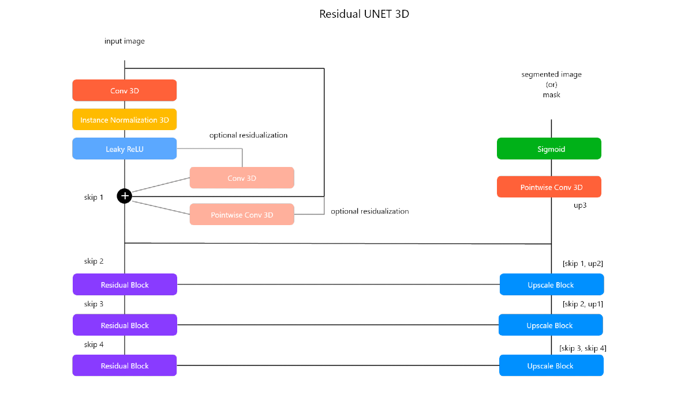
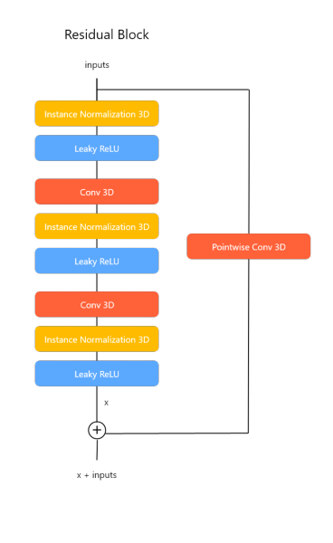
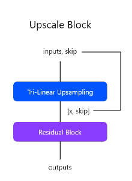
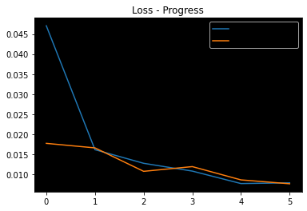

# Skull Stripping & ICA

This repository contains the end-to-end pipeline for skull-stripping of T1 Weighted MRI images and Canonical ICA of resting state fMRI to achieve the Default Mode Network (DMN) of the brain.

## Setup

Follow the below steps to setup the machine to run this project.

### Dataset

#### NFBS Skull-Stripped Repository

Download the [skull-stripped images dataset](https://fcp-indi.s3.amazonaws.com/data/Projects/RocklandSample/NFBS_Dataset.tar.gz) from the [NFBS repository](http://preprocessed-connectomes-project.org/NFB_skullstripped/) and extract the tar.gz file to get the dataset under `NFBS_Dataset` directory.

### Environment

Run the following command to install and create a virtual environment for the project. Run all these commands from inside the repository folder.

Clone to repository

`git clone https://github.com/aksh-ai/skull-stripping-and-ica.git`

Install virtual environment library

`pip install --user virtualenv`

Create a virtual environment named brain

`python -m venv brain`

To activate the vrtual environment

`.\env\Scripts\activate`

To deactivate the virtual environment

`deactivate`

### Requirements

Install the required libraries using the following command

`pip install -r requirements.txt`

## Usage

There are several scripts available in the repository that can be used to train and run inference for skull-stripping and canonical ICA

### Skull-Stripping

The following scripts can be used to train, and run inference for skull-stripping

#### Data Preparation

The data can be prepared in the required format using the `prepare_data.py` script. It takes the following arguments

```
python prepare_data.py -r ROOT_DIR -o CSV_FILE_NAME -d OUTPUT_DIR
```

Example:

```
python prepare_data.py -r 'NFBS_Dataset' -o 'NFBS_Dataset_meta.csv' -d 'data'
```

Refer `data_exp.ipynb` to run the same but in an interactive manner.

#### Training & Evaluation

The  `train.py` script can be used to train and evaluate the skull-stripping Residual UNET 3D model

```
python train.py 
       -i IMAGES_DIR       
       -l MASK_DIR         
       -m MODEL_DIR        
       -ic INPUT_CHANNELS  
       -oc OUTPUT_CHANNELS 
       -d DEVICE
       -mn MODEL_NAME
       -p PATCH_SIZE
       -b BATCH_SIZE
       -hl HISTOGRAM_LANDMARKS
       -e EPOCHS
       -ls LOSS
       -opt OPTIMIZER
       -lr LEARNING_RATE
       -s SCHEDULER
       -t TEST_SIZE
       -tb TENSORBOARD
       -c CHECKPOINT
       -log TENSOBOARD_LOG_DIR
       -v VERBOSE
       -mp MODEL_CHECKPOINT_PATH
```

Example:

```
python train.py -i 'data/images' -l 'data/targets' -m 'models' -ic 1 -oc 1 -d 'cuda' \\
      -mn 'res_unet_3d' -p 64 -b 6 -hl 'NFBS_histogram_landmarks.npy' -e 6 -ls 'MSE' \\
      -opt 'Adam' -s True -t 0.2 -tb True -c True -log 'ss_trianing_logs' -v 400
```

#### Inference

The `inference.py` script can be used to run inference on a new T1 Weighted MRI Image which outputs and saves the skull-stripped image. The model used for this is `residual_unet3d_MSE_2.pth` present under the `models` directory

```
python inference.py -i INPUT_IMAGE -o OUTPUT_IMAGE_NAME -d DEVICE -m MODEL_PATH -p PATCH_SIZE -l OVERLAP_SIZE -b BATCH_SIZE -v VISUALIZE
```

Example:
```
python inference.py -i 'T1Img\sub-02\anat_img.nii.gz' -o 'sub-02-anat-img-skull-stripped.nii.gz' -d '' -m '' -p 64 -l 16 -b 1 -v True
```

### Canonical ICA

#### Inference

## Model Architecture

Residual UNET 3D is a custom image segmentation architecture inspired from Residual Networks and UNET for 3D images. Below is the architecture diagram of the model.



The architecture basically consists of two important blocks:

* Residual Block



* Upscaling Block



This architecture is a success because of 4 reasons:

* **Residualization -** Residualization is the process of adding source tensor and feature extracted tensor to preserve the features from both source as well as extracted features. In this case, even if the feature extraction is bad in the current layer, residualization allows the next layer to learn features better without subsequential degradation of the network during forward and backward propagation (inspired from ResNet)
* **Optional Skip -** In the network, there is an optional skip connection in the beginning before applying the residual blocks. This can be done or not done based on the complexity of the image as well as inital performance of the model
* **Same Level Skips -** The tensors from downsampling and upsampling layers from the same level are concatenated and processed inorder to get better performance at segmentation (inspired from UNET)
* **Instance Normalization -** Normalization is done for each sample in the batch spatially and independently

Instantiate the model and set parallization for multi-gpu training (if available)

## Library Modules, Scripts, & Notebooks

## Results

* Skull-stripping MSE Loss progress



* Metrics

| MSE Loss | Dice Score | IoU Score  |
|----------|------------|------------|
| 0.008068 |   91.76 %  |   87.53 %  |

## References

```
@article{perez-garcia_torchio_2021,
   title = {TorchIO: a Python library for efficient loading, preprocessing, augmentation and patch-based sampling of medical images in deep learning},
   journal = {Computer Methods and Programs in Biomedicine},
   pages = {106236},
   year = {2021},
   issn = {0169-2607},
   doi = {https://doi.org/10.1016/j.cmpb.2021.106236},
   url = {https://www.sciencedirect.com/science/article/pii/S0169260721003102},
   author = {P{\'e}rez-Garc{\'i}a, Fernando and Sparks, Rachel and Ourselin, S{\'e}bastien},
   keywords = {Medical image computing, Deep learning, Data augmentation, Preprocessing},
}
```

## About