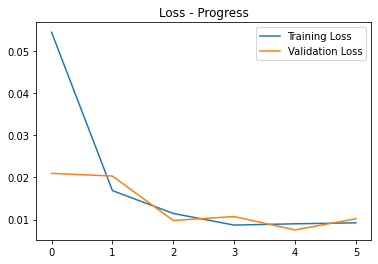

# Skull Stripping & ICA

This repository contains the end-to-end pipeline for skull-stripping of T1 Weighted MRI images and Canonical ICA of resting state fMRI (rs-fMRI) to achieve the Default Mode Network (DMN) of the brain.

## Setup

Follow the below steps to setup the machine to run this project.

### Dataset

#### NFBS Skull-Stripped Repository

Download the [skull-stripped images dataset](https://fcp-indi.s3.amazonaws.com/data/Projects/RocklandSample/NFBS_Dataset.tar.gz) from the [NFBS repository](http://preprocessed-connectomes-project.org/NFB_skullstripped/) and extract the tar.gz file to get the dataset under `NFBS_Dataset` directory.

### Environment

Run the following command to install and create a virtual environment for the project. Run all these commands from inside the repository folder.

Clone to repository

`git clone https://github.com/aksh-ai/skull-stripping-and-ica.git`

Install virtual environment library

`pip install --user virtualenv`

Create a virtual environment named brain

`python -m venv brain`

To activate the vrtual environment

`.\env\Scripts\activate`

To deactivate the virtual environment

`deactivate`

### Requirements

Install the required libraries using the following command

`pip install -r --upgrade requirements.txt`

## Usage

There are several scripts available in the repository that can be used to train and run inference for skull-stripping and canonical ICA. The parameters given in examples for the scripts were the parameters used for training, evaluation, and testing of the models to achieve the required results.

### Skull-Stripping

The following scripts can be used to train, and run inference for skull-stripping

#### Data Preparation

The data can be prepared in the required format using the `prepare_data.py` script. It takes the following arguments

```
python prepare_data.py -r ROOT_DIR -o CSV_FILE_NAME -d OUTPUT_DIR
```

Example:

```
python prepare_data.py -r 'NFBS_Dataset' -o 'NFBS_Dataset_meta.csv' -d 'data'
```

Refer `data_exp.ipynb` to run the same but in an interactive manner.

#### Training & Evaluation

The  `train.py` script can be used to train and evaluate the skull-stripping Residual UNET 3D model

```
python train.py \
      -i IMAGES_DIR \    
      -l MASK_DIR \     
      -m MODEL_DIR \       
      -ic INPUT_CHANNELS \
      -oc OUTPUT_CHANNELS \
      -d DEVICE \
      -mn MODEL_NAME \
      -p PATCH_SIZE \
      -b BATCH_SIZE \
      -hl HISTOGRAM_LANDMARKS \
      -e EPOCHS \
      -ls LOSS \
      -opt OPTIMIZER \
      -lr LEARNING_RATE \
      -s SCHEDULER \
      -sk OPTIONAL_SKIP \
      -t TEST_SIZE \
      -tb TENSORBOARD \
      -c CHECKPOINT \
      -log TENSOBOARD_LOG_DIR \
      -v VERBOSE \
      -mp MODEL_CHECKPOINT_PATH 
```

Example:

```
python train.py -i 'data/images' -l 'data/targets' -m 'models' -ic 1 -oc 1 -d 'cuda' \
      -mn 'res_unet_3d' -p 64 -b 6 -hl 'NFBS_histogram_landmarks.npy' -e 6 -ls 'MSE' \
      -opt 'Adam' -s True -sk True -t 0.2 -tb True -c True -log 'ss_trianing_logs' -v 400
```

Refer `skull_stripping_training_MSE.ipynb` notebook which was run on Google Colab for the training and evaluation of the model (without optional skip)

#### Inference

The `inference.py` script can be used to run inference on a new T1 Weighted MRI Image which outputs and saves the skull-stripped image. The model used for this is `residual_unet3d_MSE_2.pth` present under the `models` directory

```
python inference.py -i INPUT_IMAGE -o OUTPUT_IMAGE_NAME -d DEVICE -m MODEL_PATH -p PATCH_SIZE -l OVERLAP_SIZE -b BATCH_SIZE -v VISUALIZE -s OPTIONAL_SKIP
```

Example:
```
python inference.py -i 'T1Img\sub-02\anat_img.nii.gz' -o 'sub-02-anat-img-skull-stripped.nii.gz' -d 'cuda' -m 'models\residual_unet3d_MSE_2.pth' -p 64 -l 16 -b 1 -v True
```

Refer `inference.ipynb` notebook for the inference running the inference on interactive python notebooks

### Canonical ICA

The following script can be used to perform Canonical ICA for resting state MRI images to decompose the rs-fMRI scans into different componenets/networks of the brain. 

```
python ica.py -i INPUT_PATH -o OUTPUT_PATH -n NUM_COMPONENTS -v VERBOSE -vis VISUALIZE -m MEMORY_LEVEL
```

Example:

```
python ica.py -i 'Filtered_4DVolume.nii' -o 'ica_components.nii' -n 20 -v 10 -vis True -m 2
```

## Model Architecture

Residual UNET 3D is a custom image segmentation architecture inspired from Residual Networks and UNET for 3D images. Below is the architecture diagram of the model.


The architecture basically consists of two important blocks:

* Residual Block


* Upscaling Block


## Library Modules & Notebooks

The `lib` library contains the following modules which is reusable and enables to implement the required fucntionalities for the skull-stripping in just a few lines of code.

### Modules

* **data -** Requires the functions to load the NFBS datasets as whoel iamges and sub-volumes
* **layers -** Contains the neural network layers required for implementing the neural network architectures
* **losses -** Contains a collection of loss functions that can be used for image segmentation, generative adversarial networks, and variational autoencoders
* **models -** Contains the Residual UNET 3D image segmentation architecture
* **runners -** Contains the functions for training, evaluation, and inference
* **utils -** Contains functions related data preparation, image visualization, preporcessing, augmentations, and segmetation operations

### Notebooks

The notebooks contain the data exploration, data pipeline description, training, evaluation, and testing of the models

* **data_exp.ipynb -** This notebook contains the meta data csv preparation of the NFBS dataset for data preparation
* **data_exploration_playground.ipynb -** This notebook contains the data exploration of MRI images by visualizing them
* **data_pipeline_testing.ipynb -** This notebook contains the different data pipeline's (whole and sub-volumes) usages using the `data` module from `lib`
* **skull_stripping_training_MSE.ipynb -** This notebook contains the training, evaluation, and performance on the test set using the Residual UNET 3D for skull-stripping without the optional skip
* **skull_stripping_training_MSE_3.ipynb -** This notebook contains the training, evaluation, and performance on the test set using the Residual UNET 3D for skull-stripping with the optional skip
* **inference.ipynb -** This notebook contains the inference pipeline in notebook format using the `inference.py` script

## Results

The skull-stripped images for the T1 Weighted MRI test set and the Canonical ICA components image (probability atlas) for the rs-fMRI image is available at this [google drive link](https://drive.google.com/drive/folders/1hZQhQVvt0Rvz9uE3PddkBhKikky6j0Ml?usp=sharing)

* Skull-stripping on test image


* Skull-stripping MSE Loss progress

Without optional skip:


Blue - Training Loss <br>
Orange - Validation Loss

With optional skip:



Blue - Training Loss <br>
Orange - Validation Loss

* Metrics

|            Model Name            | Optional Skip | MSE Loss | Dice Score |  IoU Score |
|----------------------------------|---------------|----------|------------|------------|
| models\residual_unet3d_MSE_2.pth |     False     | 0.008068 |   91.76 %  |   87.53 %  |
| models\residual_unet3d_MSE_3.pth |     True      | 0.010058 |   91.13 %  |   86.11 %  |

* Canonical ICA components image


## References

### Papers

* [Deep Residual Learning for Image Recognition](https://arxiv.org/abs/1512.03385.pdf)
* [U-Net: Convolutional Networks for Biomedical Image Segmentation](https://arxiv.org/pdf/1505.04597.pdf)
* [DoubleU-Net: A Deep Convolutional Neural Network for Medical Image Segmentation](https://arxiv.org/pdf/2006.04868v2.pdf)
* [Vox2Vox: 3D-GAN for Brain Tumour Segmentation](https://arxiv.org/abs/2003.13653.pdf)
* [An automated method for identifying an independent component analysis-based language-related resting-state network in brain tumor subjects for surgical planning](https://www.nature.com/articles/s41598-017-14248-5)
* [Age and Alzheimer’s pathology disrupt default mode network functioning via alterations in white matter microstructure but not hyperintensities](https://www.researchgate.net/publication/324606899_Age_and_Alzheimer's_pathology_disrupt_default_mode_network_functioning_via_alterations_in_white_matter_microstructure_but_not_hyperintensities)

### Libraries

* [PyTorch](https://www.pytorch.org)
* [Nibabel](https://nipy.org/nibabel/reference/nibabel.html)
* [NiPype](https://nipype.readthedocs.io/en/latest/)
* [NiLearn](https://nilearn.github.io/index.html)
* [Scikit-Learn](https://scikit-learn.org/)
* [Numpy](https://numpy.org)
* [TorchIO](https://torchio.readthedocs.io/)
* [Matplotlib](https://matplotlib.org/)
